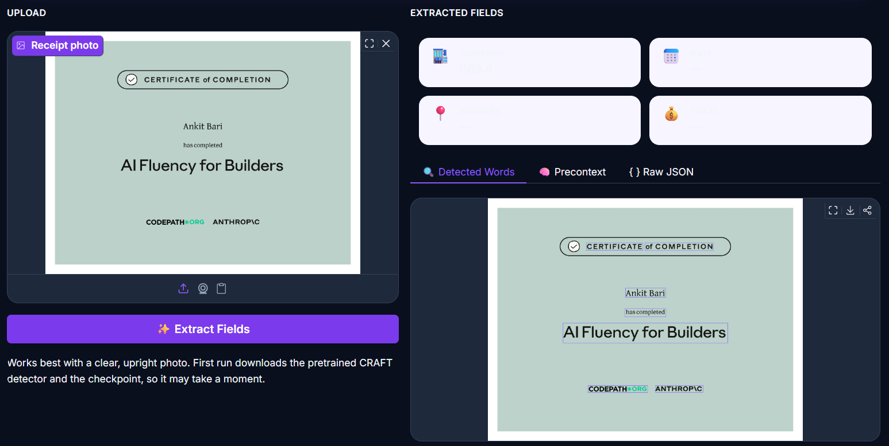

# Mini-Interfaze: Receipt Field Extractor

A small, from-scratch implementation of the *Interfaze* native-fusion pattern: a
CNN/RNN perceptual encoder (CRNN, OCR) writes directly into the embedding space
a transformer decoder reads, instead of being called as a separate tool. The
decoder emits a fixed-schema JSON object and returns per-field metadata
(`precontext`: bounding boxes + confidence) alongside it.

- **Encoder**: CRNN (CNN + BiLSTM + CTC), trained from scratch on receipt word crops.
- **Adapter**: linear + box-position projection into a shared 256-d embedding space.
- **Decoder**: 4-layer causal transformer, cross-attending over OCR memory tokens,
  with a custom **fused CUDA kernel** (`RMSNorm + residual add`) used in training.
- **Output**: `{"company": ..., "date": ..., "address": ..., "total": ...}` plus a
  `precontext` array of per-word boxes and confidences.
- **Checkpoint format**: [`safetensors`](https://github.com/huggingface/safetensors)
  (`model.safetensors` + `config.json`), hosted as a model repo on the Hugging Face
  Hub — not a pickled `.pt` file.

## Files

| File | Purpose |
|---|---|
| `mini_interfaze_receipt_extractor.ipynb` | Full training notebook (Kaggle, GPU T4x2). Trains the model, checkpoints each epoch under a disk budget, and pushes the final weights to the Hub. |
| `app.py` | Standalone Gradio inference app — loads the checkpoint from the Hub (or a local copy), no training code needed. |
| `requirements.txt` | Dependencies for the app. |
| `model.safetensors` / `config.json` | Trained weights + metadata (produced by the notebook, hosted on the Hub — see step 2). |

## 1. Train the model

Open `mini_interfaze_receipt_extractor.ipynb` on **Kaggle** with
**Settings → Accelerator → GPU T4 x2**, and run all cells top to bottom. It runs
end-to-end on a built-in synthetic receipt generator with no external dataset
required (swap in real SROIE data by setting `SROIE_ROOT` if you've attached it
as a Kaggle Input).

**Checkpointing during training.** Kaggle's `/kaggle/working` output quota is
20 GB. The notebook saves a checkpoint every epoch but rotates old ones (keeps
the most recent 2 epochs + the best-loss epoch) so it stays well under quota no
matter how many epochs you run — epoch count is bounded by session wall-clock,
not disk space.

**Saving the final checkpoint.** The last training cell writes the deployment
checkpoint as **safetensors**, not `torch.save`/`.pt`:
- `model.safetensors` — a flat tensor dict with `crnn.*`, `adapter.*`, and
  `decoder.*` prefixed keys (safetensors can't store nested Python objects, only
  `{str: tensor}`).
- `config.json` — everything that isn't a tensor: image size, model dims, the
  decoder vocab, and the field names.

**Pushing to the Hub.** The final notebook cell logs in (`login()`, prompted via
`getpass` — never hardcode a token) and uploads both files to a model repo:

```python
from huggingface_hub import HfApi
api = HfApi()
api.create_repo(REPO_ID, exist_ok=True)
api.upload_folder(folder_path=CHECKPOINT_DIR, repo_id=REPO_ID)
```

This project's checkpoint is hosted at
[`aijadugar/receipt-field-extractor`](https://huggingface.co/aijadugar/receipt-field-extractor).
If you train your own, update `HF_REPO_ID` in `app.py` to point at your repo instead.

The notebook then frees local disk (`checkpoints/` and any synthetic-data cache)
now that the weights live on the Hub.

## 2. Deploy for free — Hugging Face Spaces

This is the easiest free option: a public URL, no server to manage, CPU inference
is fast enough for this model size.

1. Go to **huggingface.co → New Space**.
2. Choose:
   - **SDK**: Gradio
   - **Hardware**: CPU basic (free) — no GPU needed for inference.
3. In the new Space's file editor (or via git), upload two files:
   - `app.py` (from this folder)
   - `requirements.txt` (from this folder)

   You do **not** need to upload the checkpoint. `app.py` pulls `model.safetensors`
   and `config.json` straight from `HF_REPO_ID` on the Hub the first time it runs.
   (If you'd rather bundle the checkpoint directly into the Space instead of
   fetching it from a separate model repo, you can still add `model.safetensors`
   and `config.json` next to `app.py` — it checks for local copies first.)
4. The Space will build automatically (installs `requirements.txt`, then runs
   `app.py`). This takes a few minutes the first time (EasyOCR downloads its
   detector weights, and the checkpoint downloads from the Hub, on first run).
5. You'll get a public URL like `https://huggingface.co/spaces/<you>/mini-interfaze`
   — share it with anyone, no login required to use it.

### Alternative: git push instead of the file editor
```bash
git clone https://huggingface.co/spaces/<your-username>/<space-name>
cd <space-name>
cp /path/to/app.py /path/to/requirements.txt .
git add .
git commit -m "Add Mini-Interfaze receipt extractor"
git push
```

### Alternative free options (if you outgrow Spaces)
- **Streamlit Community Cloud** — similar free tier, if you'd rather write the UI
  in Streamlit than Gradio.
- **Google Colab + `gradio share=True`** — fastest to test, but the link expires
  when the Colab session ends; good for a quick demo, not a persistent app.

## 3. Run locally instead (optional)

```bash
pip install -r requirements.txt
python app.py
```
Opens a local Gradio server (default `http://127.0.0.1:7860`) using either a local
`model.safetensors`/`config.json` pair (if present next to `app.py`) or, if absent,
the checkpoint downloaded from `HF_REPO_ID` on the Hub.

## Notes

- The custom CUDA kernel (fused RMSNorm+residual) is a **training-time**
  optimization. `app.py` uses an algebraically identical pure-PyTorch fallback for
  inference, so it runs fine on the free CPU tier — no GPU required to serve it.
- The checkpoint is **safetensors**, not a pickle. That means it can't hold
  arbitrary Python objects (like the config dict) directly — that's why config
  lives in a separate `config.json` next to `model.safetensors` rather than inside
  a single `.pt` file.
- Accuracy depends entirely on how much/what data you trained on. The notebook
  defaults to synthetic receipts for a fast, dependency-free demo; for real-world
  use, train on real photographed receipts (e.g. SROIE) for meaningfully useful
  extraction quality.
